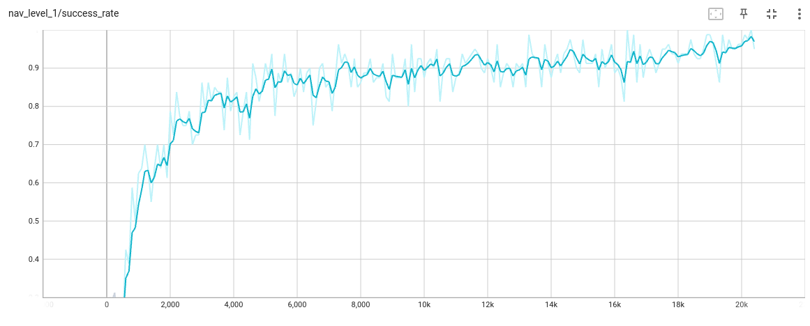

# DepthNav


https://github.com/user-attachments/assets/1e379ef5-6bd3-4e3e-9459-0f89c0350a19


DepthNav is a research framework for developing and evaluating autonomous navigation policies, particularly for aerial robots in complex 3D environments. It leverages depth sensing for navigation and provides a comprehensive suite for simulation, training, and analysis using [Habitat-sim](https://github.com/facebookresearch/habitat-sim).

## Core Components

The `depthnav` package is organized into several key modules:

### `depthnav/envs`
This module contains the simulation environments built on top of Habitat-sim.
- **`base_env.py`**: Defines the abstract `BaseEnv` class with the core environment logic, including stepping through time, handling state, and managing observations.
- **`navigation_env.py`**: Implements the primary `NavigationEnv` for navigation tasks. It defines task-specific logic such as target generation, reward calculation, and success conditions.
- **`scene_manager.py`**: A powerful manager for `habitat-sim` that handles loading 3D scenes, managing multiple agents and sensors, and procedurally spawning obstacles. It also supports calculating geodesic distances.
- **`dynamics.py`**: Models the physics of the agent, currently implemented as a `PointMassDynamics` model suitable for aerial robots.
- **`scene_generator.py`**: Provides tools to procedurally generate complex scenes with various obstacle distributions (e.g., `BoxGenerator`, `CylinderGenerator`).

### `depthnav/policies`
This module implements the neural network policies and the training algorithm.
- **`bptt_algorithm.py`**: Contains the core `BPTT` (Backpropagation Through Time) training algorithm used for training recurrent policies on sequential tasks.
- **`multi_input_policy.py`**: A flexible policy class that can handle various input modalities, including state vectors, target information, and images from multiple sensors. It can be configured with different feature extractors and recurrent layers.
- **`extractors.py`**: A collection of feature extractors that process raw observations into feature vectors for the policy. This includes CNNs for image data (`ImageExtractor`) and MLPs for state and target data (`StateExtractor`, `TargetExtractor`).
- **`mlp_policy.py`**: A basic Multi-Layer Perceptron policy.

### `depthnav/scripts`
This module contains high-level scripts for running experiments.
- **`train_bptt.py`**: The main script for training a policy using the BPTT algorithm.
- **`eval_logger.py`**: A script for evaluating a trained policy and logging a wide range of performance metrics to a CSV file.
- **`scene_viewer.py`**: An interactive viewer to inspect scenes and navigate manually.
- **`runner.py`**: A utility for running batches of experiments with different configurations, useful for hyperparameter tuning.

### `depthnav/utils`
Provides utility functions for:
- **`rotation3.py`** and **`quaternion.py`**: 3D rotations and quaternion math.
- **`maths.py`**: General mathematical utilities.
- **`type.py`**: Custom data types like `Uniform` and `Normal` distributions for randomized sampling.

## Setup

1.  **Clone the repository:**
    ```bash
    git clone git@github.com:rislab/depthnav.git --recursive
    cd depthnav/
    ```

2.  **Create a Python virtual environment:**
    ```bash
    python3.9 -m venv .venv # install python3.9 if you do not have it on the machine
    source .venv/bin/activate
    pip install --upgrade pip
    ```

3.  **Install system-wide dependencies:**
    ```bash
    sudo apt-get update
    sudo apt-get install -y --no-install-recommends libjpeg-dev libglm-dev libgl1-mesa-glx libegl1-mesa-dev mesa-utils xorg-dev freeglut3-dev
    sudo apt-get install -y libcgal-dev
    ```

4.  **Install Python dependencies:**
    ```bash
    pip install -r requirements.txt
    ```

5.  **Verify PyTorch installation:**
    Ensure that PyTorch is installed with CUDA support.
    ```bash
    python -c "import torch; print(torch.__version__); print(torch.cuda.get_arch_list()); print(torch.randn(1).cuda())"
    ```
    You should see an output similar to:
    ```
    2.2.1+cu121
    ['sm_50', 'sm_60', 'sm_70', 'sm_75', 'sm_80', 'sm_86', 'sm_90']
    tensor([0.6627], device='cuda:0')
    ```

6.  **Build and install `habitat-sim`:**
    ```bash
    cd habitat-sim
    python setup.py install --with-cuda --build-type Release --cmake-args="-DPYTHON_EXECUTABLE=$(which python) -DCMAKE_CXX_FLAGS_RELEASE='-Ofast -march=native'"
    cd ..
    ```
7.  Install the `depthnav` module
    ```bash
    pip install -e .
    ```

## Usage
Download dataset:
```bash
cd datasets/
./get_dataset.sh
```

### Training

We train the policy using `run_nav_level1.py`. The policy is trained in two
"levels". In the first level, "level0", the agent is trained for 500 iterations
in an empty environment with no collision loss. This helps the policy learn to
fly and navigate to the target without any obstacle avoidance. Next the policy
is trained in "level1" for 20K iterations with random obstacles and all loss
terms enabled. The training set includes 50 environment instances of randomly
generated cuboid obstacles.

```bash
python examples/navigation/run_nav_level1.py
```

You can follow the training progress by running tensorboard in another terminal.
Then opening `https://localhost:6006` in a web browser. Model checkpoints are 
saved in `examples/navigation/logs` every 500 iterations.

```bash
source .venv/bin/activate
tensorboard --logdir examples/navigation/logs/
```

Here is an example of what the training success rate should look like:



### Evaluation

Rollouts of the trained policy can be visualized with the `eval_visual.py`
script.  The script runs a batch of `--num_envs` agents for `--num_rollouts`
with the policy specified by the `--weight` path. A video of all the rollouts is
saved to the `--save_name` path (default is the `--weight` parent directory).

The evaluation environments are 10 random configurations of cuboid obstacles
that have been held out from the training set.

```bash
python examples/navigation/eval_visual.py \
    --weight "examples/navigation/logs/level1/level1_1.pth" \
    --render \
    --num_envs 4 \
    --num_rollouts 10
```

You should see an output like this:


https://github.com/user-attachments/assets/fd2fac5c-4fbe-4c32-b600-7a0c2df15aac


Success rate and other evaluation statistics can be obtained by running the 
`eval_logger.py` script. It will run a batch of `--num_envs` agents for 
`--num_rollouts` and append a summary of statistics to a csv file.

```bash
python depthnav/scripts/eval_logger.py \
    --weight examples/navigation/logs/level1/level1_1.pth \
    --num_envs 4 \
    --num_rollouts 10
```

## License
MIT

## Citation
If you use this work in your research, kindly consider citing us:
```bibtex
@inproceedings{lee_quadrotor_2026,
  title = {{{Quadrotor Navigation}} using {{Reinforcement Learning}} with {{Privileged Information}}},
  author = {Lee, Jonathan and Rathod, Abhishek and Goel, Kshitij and Stecklein, John and Tabib, Wennie},
  year = {2025},
  month= {Sept}
} 
```

## Acknowledgements
The authors would like to thank Ankit Khandelwal for contributions to
the codebase and Edsel Burkholder for field testing
support. This material is based upon work supported in part by
the Army Research Laboratory and the Army Research Office under
contract/grant number W911NF-25-2-0153.

This work builds off of the following open source software:
- [VisFly](https://github.com/SJTU-ViSYS-team/VisFly)
- [habitat-sim](https://github.com/facebookresearch/habitat-sim)
- [scikit-fmm](https://github.com/scikit-fmm/scikit-fmm/tree/master)
